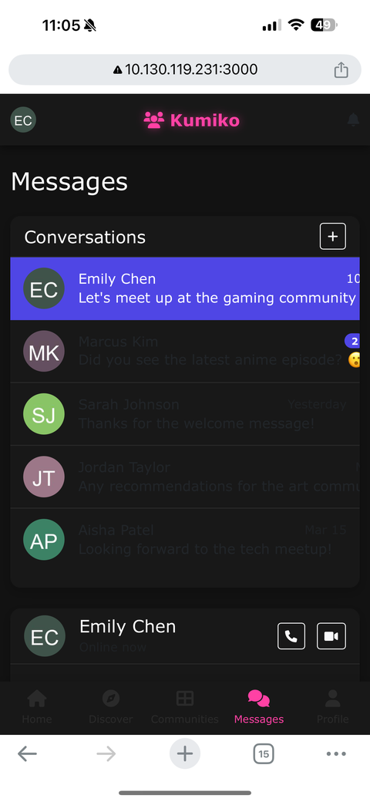
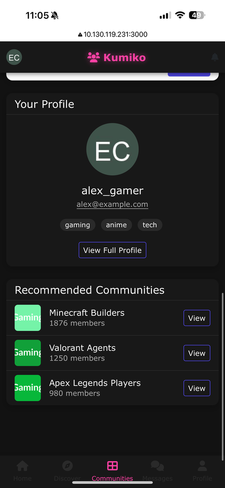
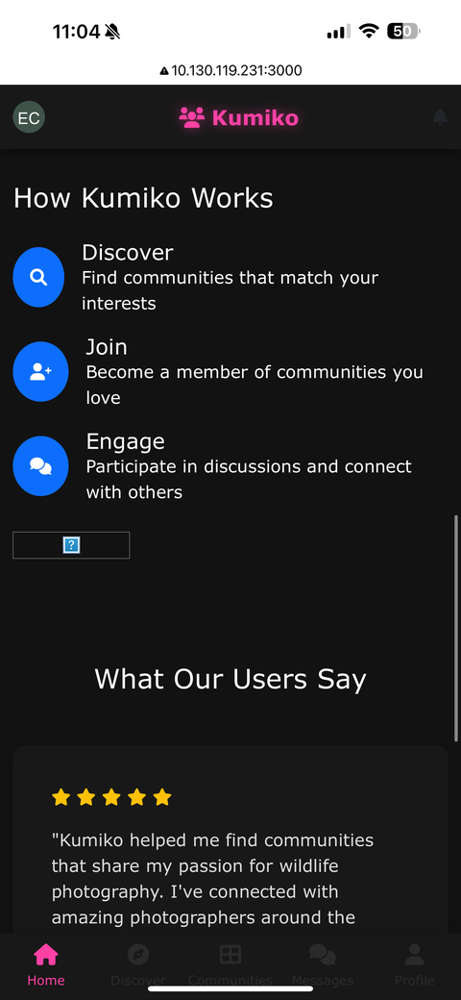
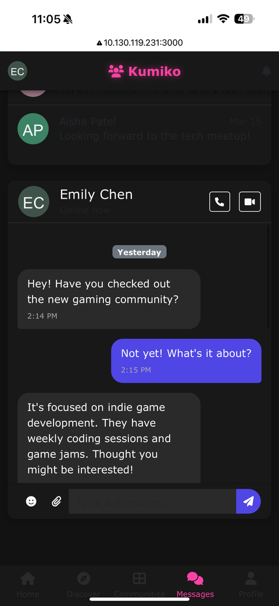
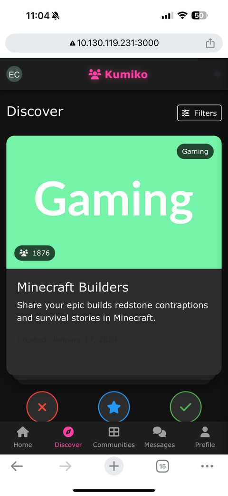
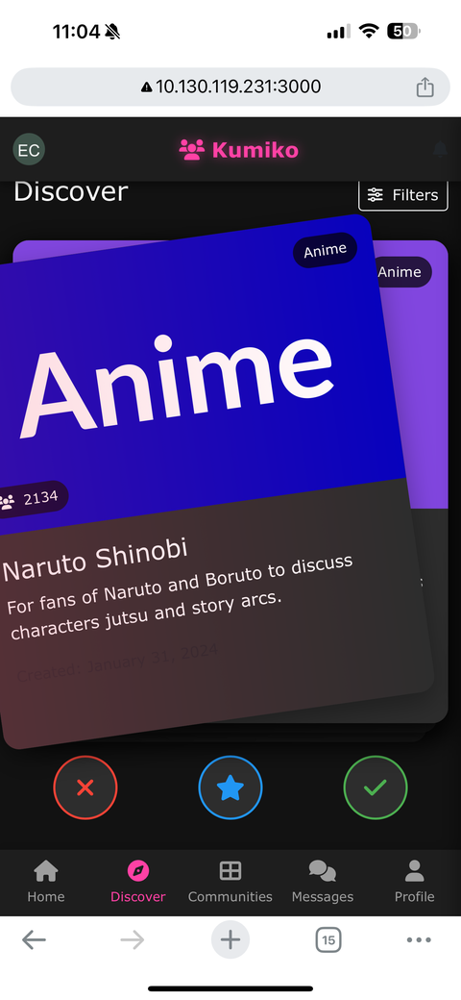
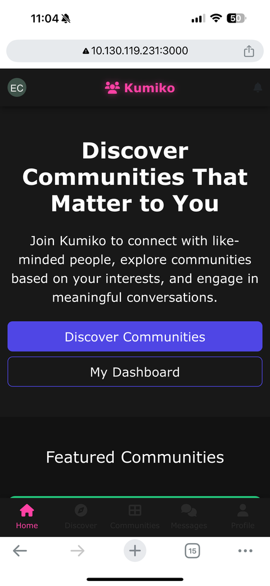

# Kumiko Community App

Kumiko is a community discovery application that helps users find and join communities based on their interests. This demo version showcases the core functionality and user interface of the platform.

## Features

### Current Features
- **Community Discovery**: Browse and discover new communities with interactive cards
- **Dark Theme UI**: Modern dark-themed user interface throughout the application
- **User Profiles**: View user profiles with community memberships
- **Dashboard**: View your joined communities and recommended communities
- **Messaging System**: Chat with other users through a beautiful messaging interface
- **Category-based Communities**: Communities organized by categories like Gaming, Technology, Art, etc.
- **Responsive Design**: Works on both desktop and mobile devices

### Demo Limitations
- Uses in-memory data storage instead of a database
- User authentication is simulated
- Community data is loaded from CSV files
- No real-time messaging (messages are static)

## Running the App

### Prerequisites
- Python 3.6 or higher
- pip (Python package manager)

### Installation Steps
1. **Clone the Repository**
   ```bash
   git clone <repository-url>
   cd kumiko_demo
   ```

2. **Create a Virtual Environment (Optional but Recommended)**
   ```bash
   # Windows
   python -m venv venv
   venv\Scripts\activate

   # macOS/Linux
   python3 -m venv venv
   source venv/bin/activate
   ```

3. **Install Dependencies**
   ```bash
   pip install -r requirements.txt
   ```

4. **Run the Application**
   ```bash
   python app.py
   ```

5. **Access the Application**
   Open your web browser and navigate to:
   ```
   http://localhost:3000
   ```

## Demo Navigation Guide
- **Home Page**: Overview of Kumiko and its features
- **Discover**: Swipe or click buttons to interact with community cards
- **Communities**: View your joined communities and recommendations
- **Messages**: Access the messaging interface (demo conversations)
- **Profile**: View your profile information

## Project Structure
- **app.py**: Main Flask application file
- **templates/**: HTML templates for the application views
- **static/**: CSS, JavaScript, and image assets
- **data/**: CSV files containing mock data
- **blueprint.md**: Detailed plan for production implementation

## Customization

To modify the demo content:
1. Edit the CSV files in the `data` directory to change community information
2. Modify the templates in the `templates` directory to adjust the UI
3. Update CSS in the template files to change the styling

### Fixing Community Images

**Note:** The current CSV files contain references to external image URLs that may not work. The app is configured to generate colorful placeholder images when the external images are unavailable.

To fix this and use your own images:
1. Open the `communities.csv` file
2. Replace the image URLs with valid image URLs or paths to local images in the `static/images` directory
3. For local images, use the format `/static/images/your-image.jpg`
4. Ensure the images exist in the specified paths

Alternatively, you can add more placeholder images by modifying the placeholder image generation logic in the application.

## Future Development

See `blueprint.md` for a detailed plan on how to convert this demo into a production-ready application, including:
- Database implementation with PostgreSQL and MongoDB
- Server infrastructure requirements
- Payment processing integration with Stripe
- Implementation roadmap and budget estimation

## Demo Images














---

This demo was created to showcase the potential of the Kumiko Community platform. It is not intended for production use in its current state.
